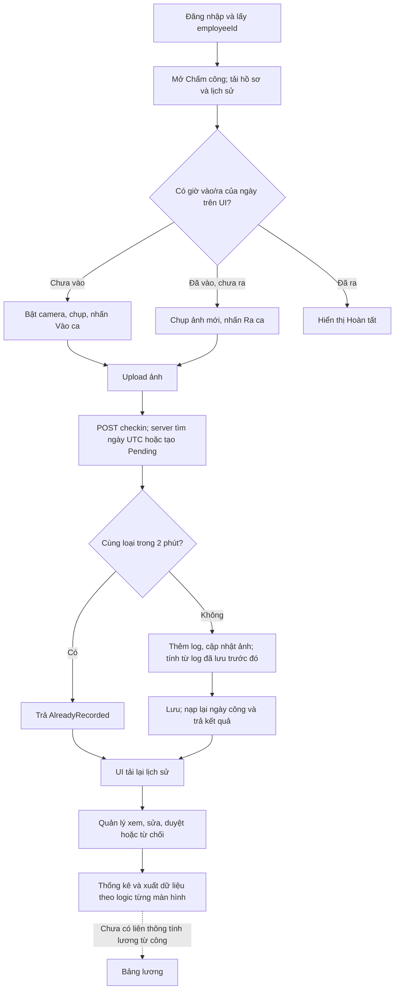

# Attendance Module — Business Analysis

Ngày review: **08/10/2026, Asia/Saigon**. Phạm vi: module Chấm công và các dependency trực tiếp trong repository; kiểm tra source, không sửa/refactor ứng dụng, không chạy backend, migration hoặc ghi dữ liệu chấm công thật. Baseline: `bdb4a43b0c01e331f0bde6db6e10f2693b71e10f`.

Đã áp dụng [Business Analyst skill](../../../.agents/skills/business-analyst/SKILL.md) và đọc các reference `spec-principles.md`, `tc-format.md`, `sdd-artifact-contract.md`. Đây là **báo cáo AS-IS tham chiếu**, chưa phải đặc tả đã được chủ nghiệp vụ chấp thuận. Không lấy quy tắc của repository cung cấp skill làm quy tắc của công ty.

Quy ước xuyên suốt:

- **FACT**: hành vi/định nghĩa thấy trực tiếp trong source hoặc kết quả probe được ghi lại; không đồng nghĩa đã xác minh trên database đang triển khai.
- **INFERENCE**: hệ quả suy ra từ các nhánh source đã trace; nêu tiền điều kiện và ví dụ có thể kiểm chứng.
- **ASSUMPTION**: giả định để giới hạn phân tích; không dùng làm yêu cầu đã chốt.
- **NEEDS VALIDATION**: phải hỏi chủ nghiệp vụ hoặc xác minh môi trường thực tế trước khi chốt chính sách.
- Severity: **Critical** = sai quyền hoặc mất tính tin cậy của công; **High** = ảnh hưởng luồng chính/tổng hợp; **Medium** = khó thao tác, kiểm soát yếu hoặc sai trong trường hợp giới hạn; **Low** = cải thiện nhỏ.

Evidence `path:line` là tọa độ tại baseline; function/class đi kèm giúp tìm lại khi dòng thay đổi. Danh mục đọc và probe ở [review-evidence.md](review-evidence.md); phần responsive chi tiết ở [UI/UX audit](../../ui-ux/01-ui-ux-pro-max-audit.md).

Để bảng dễ đọc, tên file rút gọn có quy tắc: các `*Service.cs` ở `M.Services/Services/`, `*Mapping.cs` ở `M.Services/Mapping/`, `*Controller.cs` ở `M.API/Controllers/`, các entity ở `M.Contract.Repositories/Entities/`, DTO `*ModelView.cs` ở `M.ModelViews/`. Frontend `Employee*Page.jsx` thuộc `ChamCong/src/modules/employees/attendance/pages/`, `Admin*Page.jsx` thuộc `ChamCong/src/modules/admin/attendance/pages/`; `AttendanceFormModal.jsx` không có prefix chỉ bản **employees**. `AttendancePage/AttendanceCard/CameraCapture` thuộc module `attendance`; `StatisticsPage/statUtils/StatCalendar` thuộc module `statistics`. Inventory ghi rõ file và đoạn đã đọc.

## 1. Module Purpose

**FACT:** Module lưu dấu thời gian vào/ra và ảnh, gom chúng vào một bản ghi công theo nhân viên/ngày, cho người quản lý thêm/sửa/duyệt/từ chối, rồi hiển thị lịch sử, lịch làm, thống kê và xuất dữ liệu. Hai khái niệm lưu riêng: bản ghi ngày công và từng lần chấm. Evidence: `M.Contract.Repositories/Entities/Attendance.cs:7`, `AttendanceLog.cs:7`; `M.API/Controllers/AttendanceController.cs:63`, `:81`, `:95`, `:112`, `:129`.

**INFERENCE:** Giá trị nghiệp vụ hiện có là cung cấp bằng chứng đi làm và đối soát công thủ công. Chưa có cơ sở coi đây là nguồn công đã chốt đáng tin cậy cho trả lương: dữ liệu duyệt vẫn sửa được qua đường khác, giờ công có thể không được tính sau checkout, các màn hình tổng hợp dùng công thức khác nhau (BA-01/04/07).

**FACT:** Có mô hình ca, gán ca, lịch nghỉ/làm bù, quy tắc chấm công và bảng lương. Tuy nhiên sự tồn tại của mô hình không chứng minh luồng liên thông đã hoàn chỉnh. Chấm công nhanh không đọc gán ca/quy tắc/lịch nghỉ; bảng lương nhận số tiền từ payload, không tổng hợp ngày công. Evidence: `AttendanceService.CheckInAsync`, `M.Services/Services/PayrollService.cs:70`, `M.Services/Mapping/PayrollMapping.cs:40`.

**FACT — người dùng xác nhận ngày 08/10/2026:** Giai đoạn hiện tại module chỉ dùng cho doanh nghiệp của người dùng. Lịch làm là **08:00–12:00 và 13:00–17:00**, nghỉ trưa **12:00–13:00**: một ngày đủ công là **8 giờ làm**, không phải 9 giờ hiện diện. Đây là căn cứ nghiệp vụ có độ tin cậy cao hơn default trong code. Chưa coi đa tenant, nhiều ca/ngày, ca đêm, GPS hoặc nhận diện khuôn mặt là yêu cầu phải xây trong giai đoạn này. Khả năng tương thích các trường hợp đó chỉ được ghi rõ ở phần giới hạn/NEEDS VALIDATION tương lai.

**INFERENCE có căn cứ nghiệp vụ:** Một ngày 08:00–17:00 đang được thống kê cá nhân tính 9 giờ và 1 giờ tăng ca do không trừ nghỉ trưa; đây là sai khác trực tiếp với lịch người dùng xác nhận (BA-04). Default 08:00–16:30 trong helper cũng không phản ánh giờ kết thúc thực tế; hiện nhánh CheckIn chỉ dùng mốc bắt đầu nên không được kết luận nó đang tự đánh về sớm lúc 16:30.

**FACT — xác nhận bổ sung:** Mỗi doanh nghiệp sẽ có **hệ thống và database riêng**. Không có yêu cầu dùng chung database giữa doanh nghiệp trong scope này; vì vậy không đề xuất thêm tenant isolation vào backlog bắt buộc. Quyền theo nhân viên/người duyệt trong mỗi hệ thống vẫn phải được thực thi.

## 2. Actors & Responsibilities

Quyền trong bảng là **FACT về implementation**; phạm vi HR/Admin toàn công ty và Manager chỉ người phụ trách đã được người dùng xác nhận. Các quyền chi tiết như xóa công, tự duyệt và mở lại vẫn cần chủ nghiệp vụ phê duyệt.

| Actor | Mục đích/trách nhiệm quan sát được | UI và API hiện có | Giới hạn hoặc câu hỏi |
| --- | --- | --- | --- |
| Nhân viên có tài khoản đăng nhập | Tự vào/ra ca, chụp ảnh, xem lịch sử và thống kê cá nhân; tạo đơn nghỉ | `/attendance`, `/attendance-history`, `/statistics`, `/leave`; checkin/by-employee/get-by-id chỉ yêu cầu đăng nhập | API chấm công/lấy công không đối chiếu nhân viên với tài khoản; UI tự giới hạn không bảo vệ dữ liệu (BA-03) |
| Manager | Theo dõi, thêm, sửa, duyệt/từ chối, xóa công; xem lịch làm và tổng hợp nhân viên | Nhánh `/employees/*`; Attendance get-all/create/update/approve/delete cho `Admin,Manager,HR` | **Sai với quy tắc người dùng xác nhận:** Manager chỉ được xử lý nhân viên phụ trách; code chưa lọc quan hệ này |
| HR | Đối soát và xử lý công, đơn nghỉ | Cùng quyền Attendance với Manager | Xem ca/lịch nhưng API tạo/sửa gán ca, ca và lịch lễ chỉ Admin; quyền cấu hình HR cần xác nhận |
| Admin | Các quyền trên; cấu hình ca/gán ca/lịch nghỉ/quy tắc; sửa log gốc; quản trị bảng lương | `/admin/*` và `/employees/*`; AttendanceLog create/update/adjust/delete, Shift/EmployeeShift/Holiday write, AttendanceRule/Payroll thuộc Admin | Có thể xóa hẳn công và log; chưa có giới hạn sau khi chốt |
| Người phê duyệt | Xác nhận kết quả công và lý do ngoại lệ | Là nhân viên được tham chiếu bởi `ApprovedBy`, không phải role riêng | API chấp nhận ID người duyệt từ request, chỉ kiểm tra tồn tại; chưa buộc bằng người đang thao tác |
| Hệ thống/trình duyệt | Ghi giờ phía server, lưu ảnh, tổng hợp, hiển thị tình trạng | Server lưu UTC; frontend đổi giờ VN và tính nhiều KPI | Không tìm thấy job xử lý thiếu checkout, tạo ngày vắng hoặc tự chốt kỳ trong source đã khảo sát |
| Người phụ trách lương/chủ nghiệp vụ | **NEEDS VALIDATION:** dùng kết quả công nào làm căn cứ trả lương, quyết định quy tắc ca/ngoại lệ | Payroll hiện là module phụ thuộc tiềm năng, chưa có phép tính từ Attendance | Không có bằng chứng về role Payroll riêng hoặc quy trình bàn giao công đã chốt |

**FACT — người dùng xác nhận 08/10/2026:** HR và Admin quản lý toàn công ty; Manager chỉ nhân viên mình phụ trách. Báo cáo dùng quy tắc này để đánh giá BA-03, không chờ xác nhận lại phạm vi quyền. Chưa chốt ManagerId trực tiếp hay quan hệ phân công khác là nguồn xác định “phụ trách”, và chưa chốt ai được tự duyệt công của mình.

**Evidence:** `M.API/Controllers/AttendanceController.cs:12,25,44,63,81,95,112,129,146,162`; `AttendanceLogController.cs:26,47,64,81,98,115,131`; `EmployeeShiftController.cs:22,63`; `ShiftController.cs:45`; `HolidayCalendarController.cs:47`; `AttendanceRuleController.cs:12`; `PayrollController.cs:12`; `ChamCong/src/constants/modules.js:14,31,37,54`; `M.Repositories/Context/DatabaseContext.cs:233` có quan hệ quản lý nhưng AttendanceService không dùng quan hệ này.

## 3. Current AS-IS Workflow

### 3.1 Luồng tổng thể

**FACT:** UI dùng giờ vào/ra để xác định “Chưa chấm/Đang làm/Hoàn tất”; không dùng trạng thái phê duyệt để xác nhận kết thúc công. `AttendanceCard.jsx:51–66,150–183`. Lần checkin tạo bản ghi ngày nếu chưa có, trạng thái phê duyệt Pending; chỉ chống lặp cùng loại trong 2 phút. `AttendanceService.cs:136–184`.

**FACT:** Cấu hình/gán ca là nhánh riêng. Lịch làm đọc ca hoạt động, ngày trong tuần và thời hạn gán ca; nhánh chấm công nhanh không gọi nhánh này. Người quản lý thêm công thủ công có thể truyền ca kế hoạch qua API, nhưng form quản lý hiện tại không cung cấp ca. `EmployeeWorkSchedulePage.jsx:23–55`; `AttendanceService.cs:325–343`; `EmployeeAttendanceHistoryPage.jsx:192–201`.

### 3.2 Vòng đời thực tế

| Đối tượng | Chuyển đổi đang có | Điều kiện thực thi |
| --- | --- | --- |
| UI chấm trong ngày | Chưa vào → Đang làm → Hoàn tất | Dựa trên có giờ vào/ra; hoàn tất thì ẩn camera/nút; không có gửi yêu cầu sửa công cá nhân |
| Ngày công | Tạo → Pending | Tạo nhanh hoặc tạo tay; status công có thể null |
| Quyết định công | Pending/Rejected → Approved/Rejected/Pending qua update; bất kỳ trạng thái → bất kỳ giá trị request qua approve | Update chặn bản ghi hiện tại Approved; approve không chặn trạng thái nguồn, không kiểm enum phê duyệt |
| Công đã duyệt | Update trực tiếp bị chặn | Vẫn thêm log qua checkin, sửa/xóa log với Admin, gọi approve đổi lại Pending, hoặc xóa ngày công được |
| Log gốc | Tạo → update/adjust/soft-delete/delete | Không khóa theo trạng thái của ngày công; adjust chỉ đổi metadata/ảnh/tọa độ/ghi chú, không sửa giờ |
| Sửa công | Ghi đè override, giờ công, status, duyệt, ghi chú | Chỉ giữ một `ChangeSummary` gần nhất; chưa có lịch sử phiên bản quyết định đầy đủ |

**Evidence:** `AttendanceService.cs:368–500,540–642`; `AttendanceLogService.cs:138–292`; `M.ModelViews/AttendanceLogModelView.cs:101–115`; `AttendanceMapping.cs:87–111`.

### 3.3 Kết thúc nghiệp vụ chưa được thống nhất

**INFERENCE:** “Đã chấm”, “Hoàn tất”, “Đủ công” và “Đã duyệt” hiện là bốn tiêu chí khác nhau. Một bản ghi không có log nhưng được tạo tay vẫn được lịch làm gọi “Đã chấm”; có hai giờ thì UI tự chấm báo “Hoàn tất”; thống kê có thể đếm cả công bị từ chối; API không có khóa kỳ công. Vì vậy chưa có một mốc rõ ràng “công đã được xác nhận và sẵn sàng bàn giao”. Evidence: `EmployeeWorkSchedulePage.jsx:144–150`; `AttendanceCard.jsx:62`; `statUtils.js:86–95`; `Attendance.cs:64–82`.

## 4. Detailed User Flow

### 4.1 Nhân viên tự chấm công

| Bước | Người dùng và phản hồi hệ thống hiện tại | Lý do bước tồn tại | Ngoại lệ/nhận xét |
| --- | --- | --- | --- |
| 1 | Đăng nhập; UI lấy `userId`/`employeeId`, tải hồ sơ và toàn bộ lịch sử nhân viên | Gắn thao tác với người lao động và biết tình trạng hôm nay | Thiếu employeeId yêu cầu đăng nhập lại; API chưa dùng identity làm nguồn employeeId đáng tin cậy |
| 2 | Trang tìm ngày hôm nay theo ngày của trình duyệt | Quyết định hiển thị Vào hay Ra | Server chọn ngày UTC; 00:00–06:59 VN có thể lệch (BA-02) |
| 3 | Bấm “Chụp ảnh”, cấp quyền camera, xem preview, bấm “Chụp” | Thu bằng chứng hình ảnh theo thiết kế UI | Không truy cập camera → báo cấp quyền/thử lại; chưa có luồng ngoại lệ nội bộ để ghi nhận sự cố |
| 4 | Xem ảnh, có thể xóa/chụp lại; nhấn Vào/Ra | Cho kiểm tra ảnh và xác nhận hành động | Ảnh bắt buộc trên UI; server không bắt buộc, `PhotoRequired` không chi phối |
| 5 | Upload ảnh trước; upload lỗi thì dừng | Cần URL để gắn ảnh với log | Hai request độc lập: upload thành công nhưng ghi công lỗi thì ảnh đã lưu mà chưa có công |
| 6 | Server kiểm nhân viên tồn tại, lấy thời gian server, tìm/tạo ngày UTC, kiểm lặp 2 phút | Gắn ngày và giảm bấm lặp | Không kiểm quyền sở hữu, thứ tự vào→ra, ca hiệu lực, trạng thái duyệt, loại log/method của endpoint nhanh |
| 7 | Thêm log, đồng bộ URL ảnh, tính min vào/max ra từ truy vấn log trước khi lưu; Save rồi nạp lại | Muốn tạo kết quả công từ bằng chứng | Log mới chưa có trong tập tính; kết quả có giờ nhưng actualHours/status có thể chậm một lần ghi (BA-01) |
| 8 | UI báo thành công, xóa ảnh tạm, tải lại lịch sử | Thể hiện trạng thái mới và bắt buộc ảnh mới cho lượt sau | Kết quả Attendance đã trả về bị bỏ qua; reload lỗi bị nuốt, màn hình có thể vẫn trạng thái cũ |
| 9 | Checkout xong UI ẩn camera và nút | Chốt phiên chấm trong ngày theo UI | Không có trở lại ca thứ hai trên UI; API vẫn nhận log tiếp sau 2 phút |

**Evidence:** `AttendancePage.jsx:9–66`; `AttendanceCard.jsx:68–126,142–183`; `CameraCapture.jsx:36–75`; `relatedApi.js:22–49`; `AttendanceService.cs:105–285` (các file frontend thuộc `ChamCong/src/modules/attendance/`).

### 4.2 HR/Manager/Admin đối soát và xử lý

| Bước | AS-IS | Lý do nghiệp vụ | Điểm cần kiểm soát |
| --- | --- | --- | --- |
| 1 | Vào Lịch sử & duyệt công hoặc Thống kê; UI tải trang đầu công/nhân viên/log | Có hàng đợi và dữ liệu đối chiếu | Limit 1.000 công, 500 nhân viên, 2.000 log; không lấy trang tiếp, nên “toàn bộ” không được bảo đảm |
| 2 | Chọn ngày/tháng, nhân viên, tìm kiếm, xem ảnh/giờ | Xác định bản ghi cần xử lý | Bộ lọc tháng/list/export chưa nhất quán; thống kê cho thao tác vào bản ghi mới nhất mà chưa buộc chọn ngày |
| 3 | Thêm công khi thiếu, hoặc mở Sửa | Sửa sai/quên chấm | Form tạo và form sửa dùng chung nhiều trường; một số trường được nhập nhưng payload/DTO tạo không nhận |
| 4 | Nhập ngày, giờ vào/ra, giờ thực tế, status, phê duyệt, note | Xác lập kết quả hoặc ngoại lệ | Nhiều nguồn cho cùng giờ công; ca qua ngày xử lý khác nhau giữa màn hình; lý do sửa không bắt buộc |
| 5 | Duyệt/từ chối | Xác nhận trách nhiệm với dữ liệu | Cả nhánh `/employees` và `/admin` mở form và gọi update; form employees buộc lý do từ chối, backend không buộc. API approve riêng vẫn tồn tại nhưng chưa thấy caller active ở hai trang này |
| 6 | Lưu và tải lại | Cho thấy kết quả đã ghi | Chưa có kiểm xung đột hai người sửa; không có quy trình resubmit rõ ràng cho công bị từ chối |
| 7 | Xem thống kê/xuất CSV | Đối soát kỳ và dùng ngoài module | Công đang chờ/bị từ chối vẫn được tính; chưa có mốc khóa kỳ/bản xuất đã chốt |

**Evidence:** `ChamCong/src/modules/employees/attendance/api/employeeAttendanceApi.js:6–38`; `pages/EmployeeAttendanceHistoryPage.jsx:151–224`; `pages/EmployeeStatisticsPage.jsx:39–146`; `M.Services/Services/AttendanceService.cs:435–500,540–601`.

### 4.3 Lịch làm, nghỉ và ngoại lệ

**FACT:** Lịch làm là màn hình đọc gán ca theo khoảng hiệu lực và bitmask ngày trong tuần; không tạo ngày công. Đơn nghỉ tạo Pending, chống mọi khoảng ngày trùng kể cả đơn Rejected/Cancelled; update ghi trực tiếp status/người duyệt. Không thấy cập nhật Attendance khi nghỉ được duyệt. Ngày lễ/làm bù được thống kê cá nhân sử dụng, nhưng lịch làm và checkin không dùng. Evidence: `EmployeeWorkSchedulePage.jsx:42–55`; `LeaveRequestService.cs:93–161,164–237`; `LeaveRequestMapping.cs:102–110`; `statUtils.js:66–84`; `AttendanceService.CheckInAsync`.

**NEEDS VALIDATION:** Quy tắc ưu tiên nếu vừa được duyệt nghỉ vừa đi làm, lịch lễ trùng ca, đổi ca hồi tố hoặc xin nghỉ nửa ngày. Báo cáo không tự đặt thứ tự ưu tiên.

## 5. Business Rules

Các mã BR-ATT dưới đây được gán cho **hành vi AS-IS trích xuất**, không phải chuẩn doanh nghiệp đã được duyệt. Trong phạm vi tài liệu tìm được chưa có mã BR hiện hữu để kế thừa.

| ID | Rule hiện tại — FACT | Evidence | Đánh giá |
| --- | --- | --- | --- |
| BR-ATT-001 | Ngày công/log luôn gắn một nhân viên qua Attendance; người duyệt là Employee | `Attendance.cs:11,73`; `AttendanceLog.cs:11` | Cần thêm kiểm quyền sở hữu ở operation |
| BR-ATT-002 | Tạo/sửa công tay kiểm một ngày một nhân viên, bỏ qua bản ghi soft-delete | `AttendanceService.cs:310–323,409–423` | Không có unique tương ứng DB; chưa an toàn khi đồng thời |
| BR-ATT-003 | Checkin nhanh dùng `UtcNow.Date`; log dùng thời điểm UTC server | `AttendanceService.cs:132–153` | Mâu thuẫn UI ngày VN; chưa gắn ngày bắt đầu ca |
| BR-ATT-004 | Lặp cùng loại và cùng Attendance trong 2 phút trả AlreadyRecorded | `AttendanceService.cs:167–184` | Có ích chống bấm lại, không thay thế idempotency hoặc thứ tự phiên |
| BR-ATT-005 | Tự chấm trên UI phải có ảnh mới cho mỗi lượt; server cho ảnh null | `AttendanceCard.jsx:73–80,114–116`; `AttendanceModelView.cs:140–143` | Hai hợp đồng khác nhau; cấu hình PhotoRequired chưa thực thi |
| BR-ATT-006 | Khi status null và đã có checkin trong tập truy vấn, so giờ VN với PlannedShift.StartTime, nếu không có dùng 08:00 | `AttendanceService.cs:238–257`; `AttendanceStatusEvaluator.cs:12–14` | Chưa lấy EmployeeShift; chưa dùng dung sai; chỉ tự đánh Present/Late |
| BR-ATT-007 | ActualHours backend = làm tròn số giờ từ lần vào sớm nhất đến lần ra muộn nhất | `AttendanceService.cs:221–235`; `AttendanceLogService.cs:343–368` | Không trừ break, không cộng từng phiên; giờ dạng số nguyên |
| BR-ATT-008 | Mapping ưu tiên giờ override; null thì lấy min vào/max ra từ navigation log | `AttendanceMapping.cs:13–26` | Không lọc soft-delete log, khác tập tính giờ trong service |
| BR-ATT-009 | Tạo ngày công luôn Pending; status công có thể null | `AttendanceMapping.cs:63–74`; `AttendanceService.cs:150–155` | Chưa có quy tắc tự duyệt được chứng minh |
| BR-ATT-010 | Update công đã Approved bị từ chối | `AttendanceService.cs:384–390` | Chỉ một operation khóa; chưa là invariant toàn module |
| BR-ATT-011 | Khi update sang Approved/Rejected phải có status công; approve luôn yêu cầu status hợp lệ | `AttendanceService.cs:435–443,542–549` | Chưa kiểm enum ApprovalStatus, lý do từ chối, giờ/ca hợp lệ |
| BR-ATT-012 | Approve kiểm ApprovedBy tồn tại, lưu người dùng gửi vào; Pending bỏ ApprovedAt | `AttendanceService.cs:563–586` | Không chứng minh đó là người đang duyệt |
| BR-ATT-013 | Sửa lưu người/thời gian cuối và một chuỗi diff ghi đè | `AttendanceService.cs:451–500` | Không phải audit history đầy đủ; diff giờ so với log gốc |
| BR-ATT-014 | CRUD log chỉ Admin, list log cho Admin/HR/Manager | `AttendanceLogController.cs:26,64,81,98,115,131` | Log mutation không kiểm trạng thái cha |
| BR-ATT-015 | Ca có WorkDays, IsNight, BreakMinutes, StandardHours; gán ca có From/To | `Shift.cs:24–44`; `EmployeeShift.cs:27–35` | Dùng trong lịch làm ở UI một phần; không đồng nghĩa checkin áp dụng |
| BR-ATT-016 | Lịch làm hiển thị ca active đúng weekday và nằm trong khoảng gán | `EmployeeWorkSchedulePage.jsx:42–55` | Không xét lịch lễ; có thể hiển thị nhiều ca/người/ngày |
| BR-ATT-017 | Thống kê cá nhân lấy thứ 2–6, 8 giờ/ngày; nghỉ lịch 1/2/4 loại khỏi chuẩn, làm bù 3 được thêm | `statUtils.js:66–84` | Không dựa ca được gán hoặc ngày vào/nghỉ việc |
| BR-ATT-018 | Ngày đã làm cá nhân = có checkin; giờ lấy chênh hai giờ nếu đủ, không thì ActualHours | `statUtils.js:86–95` | Không lọc approval, khác thống kê quản lý |
| BR-ATT-019 | Thống kê quản lý ngày làm = status 1/2/3; giờ cộng ActualHours | `EmployeeStatisticsPage.jsx:64–81` | Có thể khác cá nhân với cùng dữ liệu |
| BR-ATT-020 | Dư phép hiển thị = tổng maxDays loại phép active trừ mọi đơn Approved đã tải, chặn dưới 0 theo loại | `statUtils.js:99–119` | Không giới hạn kỳ/năm, chưa chứng minh quota theo người |
| BR-ATT-021 | Không cho các đơn nghỉ có khoảng ngày giao nhau dù trạng thái nào; mặc định số ngày inclusive | `LeaveRequestService.cs:124–148,202–227` | Đơn hủy/từ chối vẫn chặn tạo lại; ý định cần xác nhận |
| BR-ATT-022 | Tạo bảng lương chống trùng nhân viên/tháng, nhận các khoản và NetSalary trực tiếp | `PayrollService.cs:88–113`; `PayrollMapping.cs:46–60` | Chưa liên kết công đã duyệt/khóa kỳ |

Các model còn mô tả GPS bắt buộc, dung sai trễ, ngưỡng về sớm, nghỉ giữa ca và nhiều phương thức chấm. **FACT:** tìm kiếm các consumer chỉ thấy lưu/đọc cấu hình/mapping; không thấy thực thi trong `CheckInAsync`. **NEEDS VALIDATION:** là tính năng hứa với khách hàng, phần đang xây dựng hay cấu trúc dự phòng. Không coi chúng đã hoạt động chỉ vì có field. Evidence: `AttendanceRule.cs:26–51`; `AttendanceMethod` tại `AttendanceLog.cs:70–77`; kiểm consumer ghi ở inventory.

## 6. Current Implementation Mapping

### 6.1 Business step → UI → API/service → DB → permission

| Business step | UI | API / service | DB và dữ liệu | Permission thực thi |
| --- | --- | --- | --- | --- |
| Xác định nhân viên/tình trạng hôm nay | `AttendancePage.jsx:9–48` | Employee/get-by-user; Attendance/by-employee → ByEmployeeIdAsync | Employee; Attendance + Logs + PlannedShift + Approver | Đăng nhập; Attendance không check sở hữu |
| Chụp ảnh | `CameraCapture.jsx:36–75`; `AttendanceCard.jsx:86–103` | Upload/photo rồi Attendance/checkin | Tệp ảnh + URL trong log và ngày công | UI camera; API không áp dụng PhotoRequired |
| Vào/ra | `AttendanceCard.jsx:103–117` | POST Attendance/checkin → CheckInAsync | Attendance + AttendanceLog trong một lần SaveChanges | Đăng nhập, EmployeeId do client gửi |
| Tạo công tay | `EmployeeAttendanceHistoryPage.jsx:216–224` và form chung | POST Attendance/create → CreateAsync | Attendance Pending, có thể có override, không tạo log | Admin/Manager/HR |
| Sửa/duyệt qua form | `EmployeeAttendanceHistoryPage.jsx:151–154,181–205` | PUT Attendance/update → UpdateAsync | Override + ActualHours + Status + Approval + ChangeSummary | Admin/Manager/HR; chặn nếu hiện Approved |
| Duyệt nhánh admin | `AdminAttendanceHistoryPage.jsx:114–117,149–165` mở form | PUT Attendance/update → UpdateAsync; endpoint POST Attendance/approve tồn tại độc lập | Status/Approval/ApprovedBy/At/Note | Admin/Manager/HR ở API; UI nhánh admin chỉ Admin |
| Điều chỉnh log | Chưa thấy UI active gọi adjust trong frontend đã dò | AttendanceLog/create/update/adjust/delete → AttendanceLogService | Log; một phần sync giờ/ảnh cha | Admin; không khóa cha Approved |
| Lịch làm | `EmployeeWorkSchedulePage.jsx:23–55` | EmployeeShift/get-all + Shift/get-all + Employee/get-all + Attendance/get-all | EmployeeShift, Shift, Employee, Attendance | Read cho quản lý; write ca/gán ca Admin |
| Cấu hình quy tắc | Chưa thấy UI active CRUD quy tắc trong Attendance | AttendanceRule CRUD → AttendanceRuleService | AttendanceRules | Admin; chưa có consumer quyết định công |
| Ngày lễ/làm bù | StatisticsPage + statUtils | HolidayCalendar/get-all | HolidayCalendars | Read đăng nhập; write Admin |
| Nghỉ được duyệt | Nhánh leave và quản lý leaves | LeaveRequest/update → LeaveRequestService | LeaveRequest; không tạo/sửa Attendance | Update Admin/Manager/HR |
| Lịch sử cá nhân | AttendanceHistoryPage + HistoryTable | Attendance/by-employee | Attendance.ToViewModel ưu tiên override | Đăng nhập; không check sở hữu tại service |
| Thống kê cá nhân | StatisticsPage/statUtils | Attendance + LeaveRequest + LeaveType + HolidayCalendar read | Tính trên frontend, không tạo kết quả công đã chốt | Theo quyền từng API; cần phân biệt API lỗi với dữ liệu trống |
| Thống kê quản lý/xuất CSV | EmployeeStatisticsPage / EmployeeAttendanceHistoryPage | Attendance/get-all, Employee/get-all | Tính trên trang đầu dữ liệu đã tải | Admin/Manager/HR; chưa scope đội/phòng |
| Bảng lương | Nhánh payroll | PayrollService.Create/Update | Payroll độc lập; nhận số tiền | Admin; chưa có tham chiếu kỳ công đã chốt |

Paths frontend trong bảng thuộc `ChamCong/src/modules/`; backend thuộc `M.API/Controllers`, `M.Services/Services`, `M.Services/Mapping`, `M.Contract.Repositories/Entities` như đã nêu. Entry point/role registry: `ChamCong/src/App.jsx:65–80,118–130,151–164`; `constants/modules.js:14–61`.

### 6.2 Quan hệ và tính toàn vẹn dữ liệu

**FACT:** Employee → Attendance xóa Restrict; Attendance → Logs xóa Cascade; Approver xóa SetNull; EmployeeShift → Employee/Shift Restrict. Có các index FK, nhưng snapshot Attendance không có unique EmployeeId+ngày, log không có khóa chống lặp; không có concurrency token trong BaseEntity. Evidence: `DatabaseContext.cs:277–292,313–337`; `DatabaseContextModelSnapshot.cs:25–177`; `M.Core/Base/BaseEntity.cs:8–21`.

**FACT:** Migration ngày 07/10/2026 bổ sung `CheckInTime`, `CheckOutTime`, `ChangeSummary` vào ngày công. Schema snapshot dùng kiểu SQL Server; runtime có nhánh PostgreSQL và đồng bộ schema riêng. Báo cáo kiểm tra schema **khai báo trong repo**, không khẳng định database thật đã áp dụng đúng. Evidence: `M.Repositories/Migrations/20261007062006_AddAttendanceCheckInTimes.cs:12–31`; `DatabaseContext.cs:39–101`; `M.API/PostgresSchemaSync.cs`.

### 6.3 Dependency đang đứt hoặc chỉ là UI

- **FACT:** EmployeeShift → lịch làm: có; EmployeeShift → checkin: chưa có. PlannedShift trên ngày công là đường dữ liệu riêng.
- **FACT:** AttendanceRule → CRUD: có; → kiểm ảnh/GPS/trễ/về sớm/giờ công: chưa tìm thấy.
- **FACT:** HolidayCalendar → thống kê cá nhân: có; → lịch làm/chấm nhanh: chưa có.
- **FACT:** LeaveRequest Approved → số phép còn lại: có; → Attendance.Status=Leave: chưa có.
- **FACT:** Attendance Approved → báo cáo chỉ công hợp lệ hoặc Payroll: chưa có điều kiện nối trong các consumer đã trace.

Chưa tìm thấy job/event handler/tests nghiệp vụ Attendance trong solution và source khảo sát. README frontend là hướng dẫn template React/Vite; package chỉ có dev/build/lint/preview. Đây là giới hạn bằng chứng, không phải khẳng định công ty chưa từng kiểm thử thủ công. Lệnh khảo sát và phạm vi ở inventory.

## 7. Redundancy Analysis

Không có bằng chứng về nhiều cấp duyệt nối tiếp; vì vậy **không kết luận module đang có “duyệt hai lần”**. Kiểm tra duplicate ở UI để phản hồi nhanh và ở server để bảo vệ dữ liệu là hai trách nhiệm hợp lý, không đề xuất bỏ kiểm tra server.

| ID | Current behavior | Why it may be redundant | Evidence từ code | Impact | Recommendation |
| --- | --- | --- | --- | --- | --- |
| R-01 / BA-15 | Admin có hai vùng lịch sử và thống kê quản lý, đều xử lý cùng dữ liệu ngày công | Cùng actor/cùng dữ liệu nhưng form, validation, payload, trạng thái sau xử lý khác nhau; chưa thấy business reason cần hai trải nghiệm riêng | `App.jsx:118–130,151–164`; `EmployeeAttendanceHistoryPage.jsx:181–224`; `AdminAttendanceHistoryPage.jsx:149–173` | Người vận hành học hai cách; dữ liệu bị lưu khác tùy đường đi | Một vùng quản lý công dùng phạm vi role; giữ khác biệt permission, bỏ khác biệt logic nghiệp vụ. Không nhập luồng nhân viên tự chấm vào màn hình quản lý |
| R-02 / BA-04 | Sửa công nhập cả giờ vào/ra và ActualHours; tự tính gross rồi vẫn cho sửa độc lập | Hai biểu diễn của cùng kết quả không có quy tắc ưu tiên/bắt buộc giải trình | `employees/.../AttendanceFormModal.jsx:77–85,194–206`; `AttendanceMapping.cs:92–96` | Nhập 08:00–17:00 và 6 giờ đều lưu được; sai khác giữa báo cáo | Giờ làm tính từ cùng chính sách 08–12/13–17; điều chỉnh kết quả là ngoại lệ có lý do, không input mặc định |
| R-03 / BA-11 | Form thêm cho nhập giờ thực tế, quyết định duyệt, có trang cho giờ vào/ra; tạo xong các trường không được lưu đầy đủ | Input không đi đến kết quả khiến người dùng phải mở sửa lần nữa | `EmployeeStatisticsPage.jsx:115–138`; `EmployeeAttendanceHistoryPage.jsx:216–224`; `AttendanceModelView.cs:53–72`; `AttendanceMapping.cs:63–74` | Nhập lại, tưởng đã duyệt trong khi vẫn Pending, giờ công rỗng | Form tạo chỉ hiện dữ liệu thực sự nhận, hoặc operation nghiệp vụ tạo/ghi nhận đầy đủ một lần; không bắt user sửa sau khi thêm |
| R-04 / BA-07 | Nút Duyệt mở form sửa toàn bộ nhân viên/ngày/giờ/status; đồng thời backend có update-approval và approve operation riêng | Hành động xác nhận công không mặc nhiên cần sửa toàn bộ bản ghi; hai đường phê duyệt có guard khác nhau | `EmployeeAttendanceHistoryPage.jsx:151–154,181–205`; `AdminAttendanceHistoryPage.jsx:114–117`; `AttendanceService.cs:435–474,540–601` | Dễ đổi nhầm dữ liệu khi chỉ muốn duyệt; khó thống nhất audit/permission | Một hành động quyết định với dữ liệu đối soát chỉ đọc, status/ngoại lệ có chủ đích, lý do khi cần. Tách thao tác chỉnh sửa có kiểm soát |
| R-05 / BA-20 | Response checkin đã có Attendance cập nhật nhưng page bỏ qua, tải lại toàn bộ lịch sử | Truy vấn lại toàn lịch sử chỉ để cập nhật một ngày; nếu thất bại còn che kết quả thành công | `AttendanceService.cs:269–284`; `AttendanceCard.jsx:117`; `AttendancePage.jsx:64–66` | Thêm một lần đợi/mạng trên điện thoại; nút có thể chưa đổi dù đã ghi | Cập nhật ngày từ response đáng tin cậy; refresh bổ sung không làm mất trạng thái đã xác nhận; lỗi tải lại phải thể hiện |
| R-06 / BA-05 | Ca, rule, trường kế hoạch và helper mặc định cùng chứa giờ chuẩn; giá trị cấu hình phần lớn không được áp dụng | Với lịch cố định đã xác nhận, nhiều nơi cấu hình một chính sách tạo tải nhận thức và kỳ vọng sai | `Shift.cs:24–41`; `AttendanceRule.cs:26–48`; `AttendanceStatusEvaluator.cs:12–14`; `AttendanceService.cs:246–255` | Sửa cấu hình nhưng công không đổi; không biết nguồn nào đúng | Một chính sách hiện hành 08–12/13–17 có hiệu lực rõ. Chỉ đưa cấu hình/ca khác lên UI khi thực sự có nhu cầu đã xác nhận |
| R-07 / BA-12 | Lịch sử cá nhân, thống kê cá nhân và lịch làm dùng nhãn “đã chấm/đủ công/hoàn tất” theo tiêu chí khác | Không dư vì có nhiều màn hình; dư ở việc mỗi màn tự suy ra lại cùng trạng thái | `AttendanceCard.jsx:62–66`; `EmployeeWorkSchedulePage.jsx:149`; `statUtils.js:153–174` | Người dùng phải tự giải nghĩa lại dữ liệu, hỏi HR dù công đã ghi | Một bộ trạng thái nghiệp vụ dùng chung: dấu chấm đã ghi, kết quả tạm tính, quyết định duyệt; mỗi màn chọn mức chi tiết cần thiết |
| R-08 / NEEDS VALIDATION | Mọi ngày công tạo Pending dù đầy đủ ảnh/giờ | Duyệt toàn bộ ngày bình thường có thể tốn công, nhưng chưa biết yêu cầu kiểm soát của công ty | `AttendanceService.cs:154–155`; `AttendanceMapping.cs:73`; `statUtils.js:200–201` | Khối lượng ngày × nhân viên, có nguy cơ duyệt máy móc | Hỏi chủ nghiệp vụ cần duyệt tất cả hay duyệt ngoại lệ/chốt kỳ. Chỉ giảm bước sau khi xác nhận; không tự đề xuất bỏ phê duyệt |

Paths rút gọn `employees/...` trong bảng chỉ `ChamCong/src/modules/employees/attendance/components`; các trang cùng tên đầy đủ nằm trong `pages` của module tương ứng.

## 8. Missing Business Requirements

“Missing” ở đây là thiếu quy tắc/kiểm soát cần để hoàn tất mục đích đã có; không có nghĩa phải xây ngay tất cả giải pháp nêu ra.

### Critical

| Gap | Business reason và bằng chứng | Kết luận |
| --- | --- | --- |
| Ràng buộc tài khoản với người được chấm và phạm vi Manager phụ trách | Công là bằng chứng của từng nhân viên; người dùng xác nhận scope Manager. Endpoint đang tin EmployeeId/record ID, không lọc UserId/ManagerId (`AttendanceService.cs:68–100,118–121,373–378,554–557`) | **FACT/INFERENCE:** thiếu kiểm soát bắt buộc, BA-03 |
| Kết quả công chính xác ngay sau thao tác và chống trùng khi gửi lại/đồng thời | Người dùng cần tin “đã ghi”; thứ tự add/query/save và không unique key làm kết quả chậm/trùng (`AttendanceService.cs:167–267`; snapshot:97–105) | **FACT/INFERENCE:** BA-01/06 |
| Công đã được xác nhận phải có người chịu trách nhiệm và không thay đổi âm thầm | Update chặn Approved nhưng log/checkin/delete/approve reset không chặn; ApprovedBy nhận từ client (`AttendanceService.cs:384,580–586`) | **FACT/INFERENCE:** BA-07; chính sách mở lại cụ thể NEEDS VALIDATION |

### Important

| Gap | Business reason và bằng chứng | Kết luận |
| --- | --- | --- |
| Tính 8 giờ theo hai khoảng 08–12,13–17; loại thời gian nghỉ trưa và diễn giải trễ/về sớm | Lịch người dùng đã xác nhận; gross span và auto Present/Late hiện không đủ (`AttendanceService.cs:231–257`; `statUtils.js:84–95,129–133`) | **FACT:** yêu cầu chính; cách làm tròn, dung sai, làm trưa NEEDS VALIDATION; BA-04 |
| Quy trình thiếu checkout/chỉnh công/từ chối → sửa và gửi lại | UI đã có cảnh báo thiếu checkout và duyệt/từ chối, nhưng nhân viên không có đường gửi sửa; rejected tại history chỉ mở chi tiết (`statUtils.js:198–201`; `EmployeeAttendanceHistoryPage.jsx:367–392`) | **FACT:** thiếu đường hoàn tất trong UI; có thể quy trình ngoài hệ thống tồn tại, cần xác nhận người được xử lý; BA-09 |
| Audit đầy đủ quyết định và chỉnh sửa | Tranh chấp giờ công cần ai/sửa gì/lý do/trước-sau; hiện chỉ chuỗi diff cuối, log còn được xóa (`AttendanceService.cs:476–494`; `AttendanceLogService.cs:254–292`) | **INFERENCE:** cần lịch sử không ghi đè cho dữ liệu làm căn cứ; BA-09 |
| Thống nhất công tạm tính/công đã duyệt/công bị từ chối trong báo cáo | Approval đã là bước nghiệp vụ nhưng thống kê không dùng nó (`statUtils.js:86–95`; `EmployeeStatisticsPage.jsx:66–81`) | **NEEDS VALIDATION:** KPI nào được gồm Pending, nhưng không nên trình bày như cùng một kết quả đã chốt; BA-12 |
| Đối chiếu ngày nghỉ phép/lễ với lịch làm và công | Đơn nghỉ duyệt và ngày lễ đang hiện hữu; thiếu liên thông làm số nghỉ công khác số đơn nghỉ (`LeaveRequestService.cs:231–237`; `statUtils.js:97,159`) | **FACT:** disconnect; ưu tiên nguồn khi vừa nghỉ vừa làm cần xác nhận; BA-13 |
| Dữ liệu báo cáo đầy đủ hoặc cảnh báo chưa đầy đủ | Báo cáo công/CSV có thể dùng ngoài hệ thống; UI chỉ lấy trang đầu và nuốt một số lỗi (`employeeAttendanceApi.js:6–38`; `StatisticsPage.jsx:45–65`) | **FACT/INFERENCE:** BA-10/14; không cần đợi hệ thống lớn mới sửa hợp đồng này |
| Phân biệt “không có công” với “chưa tải được” | Khi API lỗi, hiện thống kê có thể hiện 0/ngày chưa chấm như sự thật | **FACT:** `StatisticsPage.jsx:45–65`; BA-14 |

### Nice to have

Chỉ có cơ sở cân nhắc **thao tác theo lô cho các ngày cùng điều kiện** nếu số lượng duyệt thực tế lớn và chính sách vẫn duyệt từng ngày. Lý do: hiện một ngày một form, không phải vì “có thể hữu ích”. Chưa coi đây là thiếu bắt buộc, chưa chỉ định tự duyệt, và cần đo khối lượng trước. Không đề xuất chatbot, AI chấm ảnh, dashboard bổ sung, GPS, ca đêm hay multi-tenant cho nhu cầu hiện tại.

### Needs validation

- Có phải chấm hai lượt (đầu ngày/cuối ngày) và tự loại nghỉ trưa, hay bốn lượt cho sáng/chiều? Lịch chia hai khoảng **không đủ để suy ra số lần chấm**.
- Thứ Bảy/Chủ nhật, nghỉ lễ/làm bù cụ thể, công của nhân viên vào giữa tháng; code mặc định T2–T6, chưa có xác nhận đầy đủ từ người dùng.
- Grace period, cách xử lý đi trễ rồi làm bù, về sớm, công nửa ngày; vừa trễ vừa về sớm; giá trị công dùng phút, giờ lẻ hay quy đổi ngày.
- Tăng ca có yêu cầu đăng ký/duyệt không, được tính từ mốc nào; **không tự coi mọi hiện diện sau giờ là OT được trả lương**.
- Quota phép theo năm/người/thâm niên, đơn hủy/từ chối có được tạo lại không; số còn lại hiện là phép tính UI, không phải sổ phép đã xác nhận.
- Công được chốt/bàn giao cho bảng lương hoặc xuất sang hệ thống khác ở thời điểm nào; phạm vi module hiện tại có bao gồm khóa kỳ hay chỉ thu thập/đối soát.
- Chính sách ảnh: bắt buộc với ai, quyền xem, thời hạn lưu, cơ chế khi camera hỏng. Có cấu hình GPS nhưng luồng hiện không thu GPS; **không coi GPS unavailable là sự cố hiện tại**, chỉ là điều kiện nếu chính sách này được bật thực sự sau này.

## 9. Edge Cases & Exception Flows

### 9.1 Các ví dụ kiểm chứng ưu tiên

Các kịch bản backend dưới đây là **INFERENCE từ trace**, chưa chạy API/database. Probe JavaScript là **FACT kết quả chạy hàm thuần** với dữ liệu giả; lệnh và input/output đầy đủ nằm trong inventory.

**BA-01 — Lần checkout đầu chưa tính ActualHours.** Nhân viên chưa có công hôm nay vào lúc 08:00 VN, ra lúc 17:00 cùng ngày. Lần vào: `InsertAsync` chỉ đưa log vào bộ theo dõi, query DB ngay sau đó chưa có log mới nên status vẫn null. Lần ra: query có log vào đã lưu nhưng chưa có log ra mới, nên không vào nhánh gán ActualHours; response nạp lại sau Save lại có đủ giờ vào/ra. Nếu UI sau checkout đã ẩn nút, người dùng không tự tạo lần ghi kế để kích tính lại. **Evidence:** `AttendanceService.cs:202–267,269–284`; `GenericRepository.cs:18,70–73`; `UnitOfWork.cs:47–49`. Tracking có thể nối navigation của entity, nhưng không làm bản ghi Added chưa lưu trở thành một phần kết quả SQL `logs.ToListAsync()` dùng để tính. **Tác động:** thống kê quản lý cộng null thành 0, cá nhân lại tự tính chênh giờ. **Kết quả cần bảo vệ:** sau một cặp hợp lệ, giờ và trạng thái phải tương ứng ngay trong response và các màn đọc lại.

**BA-02 — Chấm 06:30 VN bị gắn ngày trước.** Lúc 06:30 ngày 08/10 VN là 23:30 UTC ngày 07/10; server chọn AttendanceDate 07/10, UI tìm bản ghi 08/10. Nếu vào sớm để làm đúng giờ 08:00, đây là trường hợp liên quan cả lịch hành chính, không chỉ ca đêm. **Evidence:** `AttendanceService.cs:132–153`; `AttendancePage.jsx:19–25`. **Kết quả cần bảo vệ:** ngày công theo chính sách ngày VN thống nhất; thời điểm gốc vẫn lưu chính xác. Không đổi giờ ghi nhận sang đồng hồ thiết bị.

**BA-03 — Chấm/đọc công của người khác; Manager sửa ngoài phạm vi.** Trong môi trường kiểm thử với hai nhân viên A/B, gửi authenticated request checkin với EmployeeId B trong khi token thuộc A: service chỉ kiểm B tồn tại. Manager M không phụ trách B gọi get-all hoặc update/approve record B: role qua controller, service không lọc quan hệ phụ trách. Đây là sai với scope người dùng đã xác nhận. **Evidence:** controller `:12,25,63,81,112,129`; service `:91–100,118–121,373–378,554–557`. **Kết quả cần bảo vệ:** A chỉ tự chấm/đọc theo quyền; Manager không đọc hoặc đổi dữ liệu ngoài tập được phân công, kể cả gọi trực tiếp API; HR/Admin vẫn toàn công ty.

**BA-04 — Ngày đủ công bị tính 9 giờ/1 giờ OT; về sớm có thể hiện đủ công.** Probe với checkin `2026-10-08T01:00:00Z` (08:00 VN), checkout `2026-10-08T10:00:00Z` (17:00 VN) trả `hoursWorked=540` phút và `otWeekday=60` phút. Người dùng xác nhận ngày này chỉ có 8 giờ vì nghỉ 12–13. Mẫu kiểm soát khoảng 8 giờ trả 480/0, chứng minh probe không luôn báo lỗi. Nhánh status server không kiểm checkout với giờ kết thúc; cá nhân đánh `full` khi đủ cặp và status không Late/EarlyLeave, dù khoảng chỉ 2 giờ. **Evidence:** `statUtils.js:84–95,129–133,164–171`; `AttendanceService.cs:231–257`; `AttendanceFormModal.jsx:77–85`. **Kết quả cần bảo vệ:** cùng một lịch đã xác nhận sinh cùng net work minutes, late/early và kết quả hiển thị. Không chỉ sửa tên nhãn hoặc hardcode trừ 60 phút cho mọi bản ghi; trường hợp nghỉ nửa ngày/không giao giờ trưa cần tính phần giao phù hợp.

**BA-06 — Hai request cùng lúc hoặc retry sau mất phản hồi.** Hai tab/thiết bị gửi lần vào trước khi request kia lưu: cả hai có thể không thấy ngày công/log; cả hai insert, vì chỉ check-then-insert và schema không unique. Khi đã có ngày, hai log cùng loại cũng có thể cùng qua check 2 phút. Retry sau hơn 2 phút được coi lần chấm mới; endpoint còn nhận checkout trước checkin. UI giảm bấm lặp bằng `busy` và thứ tự nút nhưng không bảo vệ server. **Evidence:** `AttendanceService.cs:136–173,202,267`; snapshot `:97–105,173–177`; `AttendanceCard.jsx:150–170`. **Kết quả cần bảo vệ:** retry cùng một ý định không tạo thêm ngày/log; phản hồi chỉ rõ kết quả trước đã được ghi. Không suy luận cần hỗ trợ nhiều ca chỉ vì endpoint nhận được nhiều log.

**BA-07 — Khóa duyệt bị vượt và sai người chịu trách nhiệm.** Admin/HR duyệt công; gọi approve đặt Pending với ID một nhân viên tồn tại, rồi update; hoặc thêm log/checkin/xóa công đã duyệt trực tiếp. Không có guard tương đương update. Người gửi cũng có thể cung cấp ApprovedBy là C khác mình; trường này được lưu dù actor là D. **Evidence:** `AttendanceService.cs:384–390,563–600,604–642`; `AttendanceMapping.cs:103–105`; `AttendanceLogService.cs:78–292`. **Kết quả cần bảo vệ:** tất cả đường thay đổi công đã duyệt đi qua cùng chính sách mở lại/điều chỉnh, người quyết định lấy từ danh tính xác thực, không từ lựa chọn tùy ý của client.

**BA-08 — Soft-delete log vẫn xuất hiện ở giờ vào/ra.** Admin soft-delete log vào sớm nhất; log service chỉ lưu DeletedTime, không tính lại cha. Lần đọc Attendance include toàn bộ logs, mapping min/max không loại log deleted. Kết quả vẫn hiện giờ đã bị loại; lần tính lại giờ bằng service lại lọc log active. **Evidence:** `AttendanceLogService.cs:254–276,337–341`; `AttendanceService.cs:68–75`; `AttendanceMapping.cs:13–26`; `DatabaseContext.cs:190–358` không global query filter. Override càng tạo nguồn thời gian thứ hai. **Kết quả cần bảo vệ:** cùng một tập bằng chứng hợp lệ tạo các giá trị nhất quán; dữ liệu đã loại có thể tồn tại trong audit nhưng không còn tính vào kết quả hiện hành.

**BA-10 — Qua 1.000 bản ghi, tháng mới biến mất.** API get-all order CreatedTime tăng dần, UI chỉ lấy page1 size1000 rồi lọc tháng tại client. Với 1.100 bản ghi theo thời gian, 100 bản ghi mới nhất không nằm trong tập; đổi tháng không gửi query trang tiếp. Ví dụ 50 nhân viên × 22 ngày đã đạt 1.100 dòng trong một tháng; đây là dữ liệu vừa phải đối với doanh nghiệp. **Evidence:** `AttendanceService.cs:43–50`; `employeeAttendanceApi.js:6–9`; `EmployeeStatisticsPage.jsx:39–60`; `EmployeeAttendanceHistoryPage.jsx:42–67`. **Kết quả cần bảo vệ:** báo cáo/export cho kỳ lấy toàn bộ dữ liệu thuộc kỳ, hoặc không được thể hiện là hoàn chỉnh.

**BA-11 — Form thêm thành công nhưng mất dữ liệu vừa nhập.** HR ở thống kê nhập ngày, 08:00/17:00, giờ thực tế, chọn duyệt; create chỉ gửi nhân viên/ngày/status/note. Ở lịch sử employees, create gửi giờ thực tế nhưng `CreateAttendanceModelView` không có ActualHours, mapping không nhận; approval cũng luôn Pending. **Evidence:** `EmployeeStatisticsPage.jsx:115–138`; `EmployeeAttendanceHistoryPage.jsx:216–224`; `AttendanceModelView.cs:53–72`; `AttendanceMapping.cs:63–74`. **Kết quả cần bảo vệ:** trường hiển thị là có thể lưu phải được lưu hoặc bị báo rõ trước submit; không “thành công” rồi buộc người dùng nhập lại.

**BA-24 — Chỉ duyệt/đổi ghi chú có thể xóa giờ đã sửa và thông tin kế hoạch.** Tiền điều kiện có thể tạo qua UI employees: HR thêm công tay với giờ override, Pending. Admin mở chính ngày đó ở nhánh admin rồi duyệt bằng form; payload update tại `AdminAttendanceHistoryPage.jsx:154–165` không có CheckInTime/CheckOutTime. DTO nhận null và mapping ghi null lên override. Nếu bản ghi không có log gốc, lần đọc sau mất cả hai giờ; nếu có log, hiển thị quay về giờ gốc. Các form employees gửi giờ nhưng cũng không gửi PlannedShiftId/PlannedHours, nên có thể làm mất kế hoạch đã có qua API. **Evidence:** `AttendanceModelView.cs:88–94`; `AttendanceMapping.cs:90–96`; `AttendanceService.cs:457`; `EmployeeAttendanceHistoryPage.jsx:192–205`. **INFERENCE:** mất dữ liệu phát sinh ngay trong thao tác được cho phép, không cần request giả hay hai người cùng sửa. **Kết quả cần bảo vệ:** quyết định duyệt/đổi ghi chú không được làm thay đổi trường người dùng không chọn sửa; hợp đồng cập nhật phải phân biệt “không gửi” và “xóa có chủ đích”.

**BA-12 — Nghỉ lễ/làm bù và trạng thái công sai nghĩa.** Probe thứ Ba 06/10 loại PublicHoliday, thứ Bảy 10/10 loại MakeUpWork, mỗi ngày 8h: tổng OT lễ 480 phút thực ra đến từ **ngày làm bù**, vì code xét `makeup.has(key)`; lễ thật thứ Ba 8h không thành OT lễ. Probe dùng hai dòng Rejected vẫn đếm 2 ngày/960 phút. `dayStatusOf` trả rest trước đọc công của ngày lễ, nên công làm ngày lễ bị che trên lịch. **Evidence:** `statUtils.js:86–95,121–134,153–171`. Phân loại và giao diện là sai khác thấy trực tiếp; **NEEDS VALIDATION** mức công/OT được hưởng theo chính sách công ty, không đưa kết luận pháp lý/tiền lương. Riêng lịch tháng bỏ ô đầu tháng rồi xếp lại từ T2: 01/10/2026 (thứ Năm) trở thành ô đầu cột T2. Evidence `statUtils.js:178–188`; `StatCalendar.jsx:17,28–34`; probe ghi trong inventory.

**BA-14 — Lỗi tải thành “0 công”.** Attendance API fail nhưng Promise.allSettled trả kết quả; helper biến rejected thành []; UI kết thúc loading, không vào catch của request thất bại, và render KPI 0. **Evidence:** `StatisticsPage.jsx:45–65,146`; UI audit có kiểm trên API giả lập. **Kết quả cần bảo vệ:** nguồn dữ liệu bắt buộc lỗi phải hiện trạng thái không tải được; không thay dữ liệu thiếu bằng kết luận nhân viên không đi làm.

### 9.2 Các trường hợp còn lại liên quan implementation

| Case | Đang xử lý / chưa xử lý | Hệ quả và phạm vi |
| --- | --- | --- |
| Quên checkout qua ngày | Có cảnh báo cá nhân, không thấy job hay đường gửi bổ sung của nhân viên; HR sửa tay | **FACT:** ngoại lệ đã hiện hữu; cần chốt SLA, người sửa, chứng cứ, giới hạn hồi tố (BA-09) |
| Ra trước vào / giờ âm / Type ngoài enum | Endpoint nhanh không kiểm Type/Method; manual update không kiểm thứ tự giờ, độ dài hoặc ActualHours âm | **INFERENCE:** dữ liệu bất thường nhận được qua API; UI không thay validation server (BA-18) |
| Vừa đi trễ vừa về sớm | Một status duy nhất; auto chỉ Present/Late, chưa auto EarlyLeave | **FACT:** không biểu diễn đồng thời hai lý do bằng status hiện tại; cần phân biệt cờ vi phạm với quyết định công (BA-04/12) |
| Đổi ca/sai ca | Ca gán hiển thị ở lịch nhưng checkin dùng PlannedShift trên ngày hoặc default | **FACT:** phân tách dữ liệu. Với lịch cố định hiện tại, giải pháp ưu tiên là một chính sách chuẩn; chưa cần xây đổi ca phức tạp (BA-05) |
| Ca qua ngày | Model có IsNight, UI lịch sử có cộng một ngày cho checkout sớm hơn checkin; UI thống kê gửi cùng ngày; server chia theo UTC date | **FACT giới hạn tương thích**, **không phải yêu cầu thiếu hiện tại**. Nếu sau này nhận ca đêm phải thiết kế ngày công/phiên thống nhất trước |
| GPS unavailable | Luồng camera/checkin hiện không gọi geolocation, DTO nhanh không có tọa độ | Không ghi là bug GPS hiện tại; cấu hình GpsRequired chưa thực thi, cần bỏ kỳ vọng sai hoặc xác nhận scope |
| Camera từ chối/hỏng/không có | Báo lỗi và thử cấp quyền; ảnh vẫn bắt buộc ở UI, không có đường thay thế | Có thể khóa nhân viên khỏi tự chấm; cần cơ chế ngoại lệ đã phê duyệt, không tự thêm upload ảnh cũ thay bằng chứng mới |
| Mất mạng upload | Catch báo lỗi, giữ ảnh tạm; không offline queue | Không yêu cầu mặc định xây offline mode; cần thông báo đã/chưa ghi và retry không nhân bản |
| Upload xong, checkin timeout hoặc reload lỗi | Hai operation không cùng giao dịch; page nuốt reload lỗi | Ảnh có thể mồ côi; thành công server nhưng UI mơ hồ, retry tạo thêm ảnh/log; BA-06/20 |
| Sửa lần thứ hai | ChangeSummary so giờ với log gốc, rồi ghi đè chuỗi trước; diff không bao phủ employee/date/approval | Thiếu lịch sử thời điểm/lý do từng quyết định; không đủ kết luận “audit trail đầy đủ” (BA-09) |
| Sửa tay nhưng không tạo log | Có thể có giờ override trong ngày công nhưng KPI vào/ra một số màn đếm log | Đã đi làm theo form nhưng KPI hiện chưa checkin; cần một nguồn sự thật và nguồn gốc sửa rõ ràng |
| Ngày nghỉ phép được duyệt | LeaveRequest thay đổi riêng, Attendance không tự thành Leave | Lịch/đơn/ngày công có thể trái nhau; số “ngày nghỉ” thống kê lấy Attendance.status=5, không lấy đơn (BA-13) |
| Đơn nghỉ bị từ chối/hủy, tạo lại | Check overlap không loại Rejected/Cancelled | Có thể chặn tạo đơn thay thế; quy tắc cho phép tạo lại NEEDS VALIDATION, không coi xóa đơn là giải pháp chuẩn |
| Nhân viên mới giữa tháng/đã nghỉ | expectedWorkdays tính cả tháng; checkin chỉ kiểm chưa soft-delete, không dùng Status/StartDate/UsePhoneAttendance | Chưa chốt cách prorate chuẩn công và quyền chấm khi ngừng làm. Không khẳng định tài khoản đã khóa vẫn đăng nhập được nếu chưa kiểm auth; BA-18/23 |
| Hai người quản lý cùng sửa/duyệt | Không version/concurrency token, DTO không gửi bản đọc ban đầu | **INFERENCE:** lưu sau có thể ghi đè thay đổi trước; cần thông báo đã thay đổi khi đối soát, BA-07/09 |
| Chọn tháng/xuất dữ liệu | Employees history đổi tháng bỏ selectedDate; list không lọc calMonth nhưng export lọc tháng | Người vận hành thấy và xuất hai tập khác nhau; BA-21 |
| Sửa từ thống kê tổng | Chọn bản ghi mới nhất trong tháng; nếu không có tạo object không id nhưng modal dùng `!!row` là edit | Có thể sửa nhầm ngày hoặc gửi update thiếu id; BA-22 |

**Evidence bổ sung:** `AttendanceModelView.cs:75–143`; `Employee.cs:115–134`; `EmployeeAttendanceHistoryPage.jsx:76–87,112–119,158–160,186–190`; `EmployeeStatisticsPage.jsx:107–138,299–313`; `AttendanceFormModal.jsx:30–50,112`; `AttendanceLogService.cs:207–251`; `AttendanceService.cs:451–494`.

## 10. Pain Points

| Người chịu ảnh hưởng | Pain point / tác động | Evidence và finding |
| --- | --- | --- |
| Nhân viên | Chấm thành công nhưng thông tin hôm nay chưa đổi; phải đoán có cần chấm lại | Response bị bỏ qua/reload lỗi bị nuốt; BA-20 |
| Nhân viên | Có đủ giờ trong lịch sử nhưng thống kê quản lý bằng 0, hoặc ngày chuẩn 8h lại hiện 9h | BA-01/04/12; ảnh hưởng niềm tin vào kết quả công |
| Nhân viên trên điện thoại | Phải mở camera, chụp, kiểm ảnh, bấm lưu hai lần mỗi ngày; thiếu camera thì không thể hoàn tất | `AttendanceCard.jsx:73–117`, `CameraCapture.jsx:36–75`; không tự kết luận ảnh dư nếu nó là chính sách cần thiết |
| Nhân viên quên checkout / công bị từ chối | Có cảnh báo nhưng không có hành động tiếp theo rõ ràng trên màn tự phục vụ | `statUtils.js:193–211`; `AttendanceCard.jsx:150–183`; BA-09 |
| HR/Manager | Thêm xong phải sửa lại giờ/duyệt; nhiều trường có vẻ sửa được nhưng tạo không lưu | BA-11; đây là thao tác lặp có thể loại bỏ ngay trong thiết kế |
| HR/Manager | Để chỉ duyệt một ngày phải mở form có nhân viên/ngày/giờ/status; rejected tại history thiếu đường sửa lại | `EmployeeAttendanceHistoryPage.jsx:151–154,367–392`; BA-07/09/15 |
| Manager | Thấy dữ liệu ngoài phạm vi phụ trách; khó biết việc nào mình chịu trách nhiệm | Sai với quy tắc đã xác nhận; BA-03 |
| Người đối soát | “Đúng giờ”, “Đủ công”, “Đang làm”, “Đã chấm”, “Đã duyệt” không tương ứng cùng điều kiện | BA-12; đủ một cặp giờ có thể bị diễn giải thành đủ công |
| Người xuất báo cáo | List/export lệch kỳ, dữ liệu chỉ trang đầu nhưng không báo thiếu | BA-10/21; nguy cơ báo cáo sai mà không có lỗi kỹ thuật hiển thị |
| Admin | Nhiều nơi khai báo giờ chuẩn nhưng không có nguồn được áp dụng thống nhất | BA-05/15; thay config không sửa được nghiệp vụ |

**Laptop/desktop/mobile:** luồng nghiệp vụ phải hiển thị người, ngày, giờ và quyết định trong cùng ngữ cảnh; trên điện thoại bảng rộng và điều hướng cần kiểm riêng. Kết quả viewport/screenshot và các kiểm tra bàn phím, modal, nút chạm nằm trong [UI/UX audit](../../ui-ux/01-ui-ux-pro-max-audit.md). Báo cáo này không suy từ CSS rằng camera/GPS/keyboard thật đã hoạt động; các phép thử giao diện dùng dữ liệu giả không xác nhận API/live database.

## 11. AS-IS → TO-BE Recommendation

Đề xuất theo giá trị nghiệp vụ, **không có code thay đổi**. Dữ liệu triển khai từng doanh nghiệp riêng đã được xác nhận; không đưa dự án multi-tenant vào kế hoạch này.

| Ưu tiên | AS-IS | TO-BE đề nghị | Business reason / điều kiện chấp nhận |
| --- | --- | --- | --- |
| P0 | Tin employeeId/phạm vi role rộng | Identity xác định nhân viên tự chấm; Manager chỉ người phụ trách, HR/Admin toàn công ty; cùng scope trên read/write/export | Thực thi đúng trách nhiệm đã xác nhận; gọi API trực tiếp cũng không vượt phạm vi |
| P0 | Ghi log rồi tính trên tập cũ; chống lặp 2 phút ở tầng logic | Mỗi ý định chấm có một kết quả xác định; ngày/log/kết quả liên quan nhất quán ngay sau lưu; retry không tạo thêm bằng chứng | Nhân viên nhìn thấy đã ghi, quản lý nhìn cùng dữ liệu; BA-01/06 |
| P0 | Gross hours và nhiều công thức KPI | Một chính sách ngày làm **08–12,13–17**, tính net thời gian hợp lệ, tách số phút thực tế với quyết định công/OT | Ngày đúng lịch = 8h; nghỉ trưa không tự thành OT; thuật toán nửa ngày và dung sai phải được chốt |
| P0 | Approved chỉ khóa một endpoint | Quyết định duyệt có actor thật, lịch sử; mọi thay đổi sau duyệt qua cùng quy tắc mở lại/điều chỉnh | Tránh công được xác nhận bị đổi âm thầm; chính sách tự duyệt và khóa kỳ cần xác nhận |
| P1 | Hai màn quản lý và nhiều cách thêm/sửa | Một vùng “Quản lý công” theo scope role: lịch sử → chi tiết một ngày → sửa ngoại lệ/duyệt | Giảm bỏ sót dữ liệu, giảm huấn luyện; cùng thao tác có cùng payload/validation |
| P1 | Tạo/sửa nhập nhiều dữ liệu dẫn xuất | Tự điền người/ngày từ ngữ cảnh; giờ công tính cùng rule; chỉ ngoại lệ mới nhập lý do và dữ liệu điều chỉnh | Không nhập hai nguồn trái nhau; input nào được nhập phải lưu được |
| P1 | Cảnh báo thiếu checkout/từ chối chỉ là text | Ngoại lệ có trạng thái và người xử lý rõ; từ cảnh báo đi đến hành động được phép, ghi lý do, trả kết quả cho nhân viên | Hoàn tất nghiệp vụ quên/sai công; không tự mặc định thêm một cấp duyệt |
| P1 | Read cả lịch sử rồi lọc/cắt tại client | Query đúng kỳ/phạm vi, báo cáo/export cùng điều kiện; thông báo rõ nếu nguồn tải lỗi | Kết quả không mất ngày khi vượt 1.000 dòng; không biến lỗi thành 0 |
| P1 | Đơn nghỉ/lễ và công độc lập | Một quyết định ngày công tra cùng lịch chuẩn/lịch nghỉ/đơn nghỉ; hiển thị xung đột để xử lý | Tránh HR nhập lại nghỉ đã duyệt; chốt thứ tự ưu tiên với owner trước |
| P2 có điều kiện | Pending mọi ngày | Đánh giá duyệt theo ngoại lệ hoặc xác nhận theo kỳ nếu chủ nghiệp vụ đồng ý | Chỉ giảm thao tác khi không mất kiểm soát; không tự áp dụng |
| P2 có điều kiện | Payroll nhập độc lập | Nếu công là đầu vào lương: xác định hợp đồng bàn giao kỳ công đã chốt, version và cách sửa hồi tố | Không yêu cầu xây máy tính lương trong module nếu công ty dùng hệ thống khác |

Luồng đích tối thiểu: **Mở trang → biết ngày và hành động tiếp theo → thu bằng chứng theo chính sách → ghi một lần → nhận xác nhận cùng kết quả tạm tính → chỉ đưa ngoại lệ đến đúng người phụ trách → quyết định có dấu vết → đối soát/xuất theo cùng kỳ và cùng công thức**. Số lượt chấm trong ngày và phạm vi tự động duyệt còn NEEDS VALIDATION.

Các tiêu chí nghiệm thu nghiệp vụ để thảo luận, chưa đánh dấu đã test backend:

| ID | GIVEN / WHEN / THEN | Truy vết |
| --- | --- | --- |
| TC-ATT-001 | GIVEN nhân viên A có lịch 08–12,13–17; WHEN A chấm 08 và 17; THEN một ngày công có 8 giờ theo chính sách, không tự phát sinh 1 giờ OT, cùng kết quả ở các màn | BR-ATT-007/017; BA-01/04; NEEDS VALIDATION số lượt chấm |
| TC-ATT-021 | GIVEN M chỉ phụ trách A; WHEN M đọc/sửa/duyệt B ngoài phạm vi; THEN thao tác bị từ chối và dữ liệu B không đổi | Quy tắc người dùng xác nhận; BA-03 |
| TC-ATT-031 | GIVEN ngày công đã duyệt; WHEN người dùng muốn sửa; THEN chỉ luồng điều chỉnh được phép hoạt động, lưu actor/lý do/trước-sau, không sửa âm thầm | BA-07/09; NEEDS VALIDATION chính sách mở lại |
| TC-ATT-051 | GIVEN request đã được ghi nhưng thiết bị chưa nhận phản hồi; WHEN retry cùng ý định; THEN thấy kết quả đã ghi, không thêm một ngày/log trùng | BA-06 |
| TC-ATT-061 | GIVEN kỳ có hơn 1.000 bản ghi; WHEN mở/xuất kỳ; THEN tổng và danh sách bao phủ toàn kỳ theo scope quyền, hoặc báo rõ không hoàn chỉnh | BA-10/21 |
| TC-ATT-071 | FOR ALL nhân viên và ngày hợp lệ: kết quả tự chấm/đọc/duyệt tuân theo quyền và ngày nghiệp vụ; boundary là nhân viên ngoài quyền/ngày sai → từ chối, dữ liệu trước không đổi | BA-02/03/06; property đề xuất, chưa có test executable trong repo |

Các dòng trên là scenario review ngắn, không tạo PBI/story hoặc ước lượng story points vì người dùng yêu cầu audit, chưa phê duyệt backlog implement.

## 12. Findings Summary

| ID | Finding | Type | Severity | Evidence | Recommendation |
| -- | ------- | ---- | -------- | -------- | -------------- |
| BA-01 | **FACT + INFERENCE:** log mới chưa nằm trong tập tính trước Save; lần checkout đầu có giờ hiển thị nhưng ActualHours chưa tính | BUG / WRONG BUSINESS LOGIC | High | `AttendanceService.cs:202–267`; `GenericRepository.cs:70`; sec.9.1 | Tính/lưu cùng kết quả nghiệp vụ rồi trả và đọc lại nhất quán |
| BA-02 | **FACT + INFERENCE:** ngày UTC lệch ngày VN trước 07:00 | BUG / WRONG BUSINESS LOGIC | High | `AttendanceService.cs:132–153`; `AttendancePage.jsx:19–25` | Chốt ngày nghiệp vụ VN, tách ngày công với instant ghi nhận |
| BA-03 | **FACT:** thiếu ownership và phạm vi Manager trái xác nhận người dùng | BUG / WRONG BUSINESS LOGIC | Critical | `AttendanceController.cs:12,25,63,81,112,129`; `AttendanceService.cs:68–121,373,554` | Scope identity/nhân viên phụ trách trên mọi đường đọc/ghi |
| BA-04 | **FACT:** lịch chuẩn 08–17 nghỉ 12–13 bị tính gross 9h/1h OT; auto không đánh về sớm | BUG / WRONG BUSINESS LOGIC | High | User confirmation 08/10/2026; `statUtils.js:84–95,129–133`; `AttendanceService.cs:231–257` | Một rule net work theo khoảng được xác nhận, chốt grace/rounding/OT |
| BA-05 | **FACT:** cấu hình ca/rule/phép/ngày lễ không cùng chi phối kết quả checkin | COMPLEXITY | Medium | `AttendanceRule.cs:26–51`; `AttendanceService.cs:105–285`; `EmployeeWorkSchedulePage.jsx:42–55` | Chuẩn hóa chính sách hiện hành; ẩn/phân biệt cấu hình chưa áp dụng, không xây ca phức tạp chưa cần |
| BA-06 | **FACT + INFERENCE:** không uniqueness/idempotency, không kiểm thứ tự vào/ra | BUG / WRONG BUSINESS LOGIC | High | `AttendanceService.cs:136–202`; snapshot `:97–105,173–177` | Bảo vệ một kết quả cho cùng ý định và state hợp lệ |
| BA-07 | **FACT:** duyệt/reset/checkin/log/delete vượt khóa; actor duyệt client-controlled | BUG / WRONG BUSINESS LOGIC | High | `AttendanceService.cs:384–390,580–586,604–642`; `AttendanceMapping.cs:103` | Actor từ auth; một chính sách transition/khóa xuyên operation |
| BA-08 | **FACT + INFERENCE:** đọc lại vẫn lấy giờ từ log soft-delete; override/tổng giờ khác nguồn | BUG / WRONG BUSINESS LOGIC | High | `AttendanceMapping.cs:13–26`; `AttendanceLogService.cs:254–276,337–368` | Cùng tập bằng chứng active cho kết quả; audit giữ riêng |
| BA-09 | **FACT/NEEDS VALIDATION:** audit ghi đè và thiếu đường xử lý quên công/từ chối hoàn chỉnh | MISSING | High | `AttendanceService.cs:451–494`; `EmployeeAttendanceHistoryPage.jsx:367–392`; `AttendanceCard.jsx:150–183` | Chốt người xử lý/giải trình/resubmit, giữ lịch sử quyết định |
| BA-10 | **FACT + INFERENCE:** “toàn bộ”/export thực tế chỉ trang đầu, mất dữ liệu mới sau limit | BUG / WRONG BUSINESS LOGIC | High | `AttendanceService.cs:43–50`; `employeeAttendanceApi.js:6–38`; `EmployeeStatisticsPage.jsx:39–60` | Đọc đúng kỳ và đủ trang; cùng filter cho export |
| BA-11 | **FACT:** form thêm nhập trường nhưng create bỏ dữ liệu | BUG / WRONG BUSINESS LOGIC | High | `EmployeeStatisticsPage.jsx:115–138`; `EmployeeAttendanceHistoryPage.jsx:216–224`; DTO `AttendanceModelView.cs:53–72` | Hợp đồng tạo khớp UI; không phải thêm xong sửa lại |
| BA-12 | **FACT/NEEDS VALIDATION:** công thức, nhãn, holiday OT, lịch và approval khác nhau | BUG / WRONG BUSINESS LOGIC | High | `statUtils.js:86–188`; `EmployeeStatisticsPage.jsx:64–81`; probes inventory | Thống nhất kết quả; tách tạm tính/đã duyệt; sửa phân loại lễ/làm bù và ô lịch |
| BA-13 | **FACT/NEEDS VALIDATION:** phép duyệt chưa nối công; quota cộng mọi năm; đơn hủy/từ chối vẫn chặn | MISSING | Medium | `LeaveRequestService.cs:135–148,210–237`; `statUtils.js:97–119` | Chốt kỳ phép/nguồn công nghỉ/thứ tự ưu tiên; không tự chế chính sách |
| BA-14 | **FACT:** API thống kê lỗi bị chuyển thành dữ liệu trống/0 | BUG / WRONG BUSINESS LOGIC | High | `StatisticsPage.jsx:45–65`; UI audit runtime fixture | Hiển thị không tải được; phân biệt empty với error |
| BA-15 | **FACT:** hai vùng quản lý cùng nghiệp vụ nhưng khác payload/validation | DUPLICATION | Medium | `App.jsx:118–130,151–164`; hai history submit functions | Một vùng quản lý theo scope role, dùng chung quy tắc |
| BA-16 | **FACT/NEEDS VALIDATION:** chưa có hợp đồng chốt công → payroll | NEEDS VALIDATION | Medium, có điều kiện | `PayrollService.cs:70–113`; `PayrollMapping.cs:46–60` | Xác nhận module chịu trách nhiệm đến đâu; nếu dùng cho lương cần kỳ/version/nguồn chốt |
| BA-17 | **FACT/NEEDS VALIDATION:** ảnh bắt buộc chỉ UI, policy không được server thực thi; GPS chỉ field | MISSING | Medium | `AttendanceCard.jsx:73–80`; `AttendanceModelView.cs:130–143`; `AttendanceRule.cs:44–48` | Chốt chính sách chứng cứ, fallback camera và quyền/thời hạn ảnh; thực thi đồng bộ |
| BA-18 | **FACT:** validation thời gian/giờ/enum approval/type/method ở các đường không nhất quán | MISSING | High | `AttendanceService.cs:105–285,425–443,540–586`; `AttendanceLogService.cs:100–116`; DTOs | Validation nghiệp vụ trung tâm, lỗi cụ thể; không tin UI hoặc Required trên value-type |
| BA-19 | **FACT/NEEDS VALIDATION:** dữ liệu hỗ trợ ca đêm/nhiều ca nhưng đường tính không hoàn chỉnh | NEEDS VALIDATION | Low cho scope hiện tại | `Shift.cs:36–41`; `EmployeeShiftService.cs:89–150`; `EmployeeStatisticsPage.jsx:125–126` | Ghi giới hạn sản phẩm; không đưa vào yêu cầu bắt buộc lịch cố định |
| BA-20 | **FACT:** bỏ kết quả checkin và reload toàn lịch sử, lỗi refresh im lặng | REDUNDANT | Medium | `AttendancePage.jsx:64–66`; `AttendanceCard.jsx:117`; `AttendanceService.cs:269–284` | Dùng kết quả đã xác nhận, refresh không che thành công |
| BA-21 | **FACT:** đổi tháng/list/export không cùng tập | UX FRICTION | Medium | `EmployeeAttendanceHistoryPage.jsx:76–87,112–119,158–160` | Hiển thị kỳ/phạm vi rõ, cùng điều kiện bảng và xuất |
| BA-22 | **FACT + INFERENCE:** sửa từ dòng tổng chọn ngày mới nhất; chưa có công lại update không id | UX FRICTION | High | `EmployeeStatisticsPage.jsx:107–138,299–313`; `AttendanceFormModal.jsx:112` | Chọn ngày/bản ghi cụ thể trước sửa; thiếu bản ghi đi đúng luồng tạo |
| BA-23 | **FACT/NEEDS VALIDATION:** chuẩn công và quyền chấm chưa xét thời hạn làm việc/trạng thái nhân viên | NEEDS VALIDATION | Medium | `Employee.cs:115–134`; `AttendanceService.cs:118–121`; `statUtils.js:66–84` | Chốt prorate/onboarding/offboarding; tránh kết luận trước kiểm auth toàn hệ thống |
| BA-24 | **FACT + INFERENCE:** duyệt/sửa nhánh admin có thể xóa giờ override; các form bỏ trường kế hoạch | BUG / WRONG BUSINESS LOGIC | High | `AdminAttendanceHistoryPage.jsx:154–165`; `AttendanceMapping.cs:90–96`; `EmployeeAttendanceHistoryPage.jsx:192–205` | Quyết định duyệt không ghi đè dữ liệu vắng trong payload; phân biệt bỏ qua và xóa |

Độ tin cậy các fact source/probe: cao (khoảng 95–99%); hệ quả backend ở điều kiện mô tả: cao (khoảng 90–95%), vẫn cần regression trên database test cô lập. Chính sách chưa được xác nhận không gán độ tin cậy giả bằng số; giữ NEEDS VALIDATION. Không có finding nào dựa chỉ vào tên file/biến.

## 13. Open Questions

### Đã xác nhận từ người dùng trong phiên review ngày 08/10/2026

1. Hiện module dùng cho doanh nghiệp của người dùng.
2. Mỗi doanh nghiệp có hệ thống/database riêng khi triển khai.
3. Lịch làm **08:00–12:00, 13:00–17:00**, nghỉ trưa **12:00–13:00**; tổng ngày chuẩn 8 giờ.
4. **HR/Admin toàn công ty; Manager chỉ nhân viên phụ trách.**

Không hỏi lại các quyết định trên. Những câu hỏi còn mở, sắp theo khả năng đổi thiết kế:

| Ưu tiên | Câu hỏi cần owner xác nhận | Vì sao cần câu trả lời |
| --- | --- | --- |
| 1 | Chấm đầu/cuối ngày rồi tự loại giờ trưa, hay chấm riêng sáng/chiều? Khi làm xuyên giờ trưa xử lý thế nào? | Quyết định state phiên và công thức giờ; không thể suy số lượt chấm từ hai khoảng làm việc |
| 1 | “Nhân viên phụ trách” lấy trực tiếp từ Employee.ManagerId hay phân công/phòng ban; có ủy quyền/tạm thay không? Manager/HR/Admin có được duyệt công của chính mình? | Phạm vi role đã chốt nhưng quan hệ dữ liệu và separation of duties chưa rõ |
| 1 | Mọi ngày đều cần duyệt hay chỉ ngoại lệ? Khi đã duyệt, ai được mở lại, cần lý do/chấp thuận nào? | Chọn workflow tối thiểu; không tự bỏ duyệt hoặc thêm cấp duyệt |
| 1 | Quên checkout/sai ảnh/sai giờ: nhân viên gửi yêu cầu ở đâu, ai sửa, bằng chứng nào đủ, giới hạn hồi tố bao lâu? | Hoàn tất exception flow và lưu trách nhiệm |
| 1 | Đi trễ/về sớm cho phép dung sai bao nhiêu, làm tròn phút thế nào, có được bù giờ không? | Tránh gắn Late đồng nghĩa thiếu công hoặc đúng giờ đồng nghĩa đủ công |
| 2 | Ngày làm trong tuần, làm bù/lễ và nhân viên mới giữa tháng áp dụng lịch nào? | Code hiện mặc định T2–T6 cả tháng; chưa xác nhận đây là chính sách |
| 2 | Thống kê công hiển thị tạm tính hay chỉ duyệt? Công Rejected là không hợp lệ, yêu cầu sửa, hay quyết định cuối? | Quyết định tổng báo cáo và đường quay lại xử lý |
| 2 | Tăng ca được ghi nhận theo hiện diện hay cần yêu cầu/chấp thuận riêng? | Không tự biến khoảng ngoài lịch thành OT hưởng lương |
| 2 | Công nghỉ phép/lễ có tạo dòng công không; khi vừa nghỉ đã duyệt vừa có log đi làm ưu tiên thế nào? Quota phép tính theo năm/người ra sao? | Kết nối nguồn dữ liệu hiện đang độc lập |
| 2 | Kết quả công dùng trực tiếp tính lương, export sang nơi khác, hay chỉ quản lý đi làm? Mốc chốt và sửa sau kỳ là gì? | Chỉ xây hợp đồng bàn giao/khóa kỳ khi có business reason cụ thể |
| 2 | Ảnh bắt buộc với mọi người hay theo nhóm; khi camera lỗi cho xử lý ngoại lệ nào; ai được xem, lưu bao lâu? GPS có nằm trong scope hiện tại không? | Chính sách bằng chứng và khả năng hoàn tất trên điện thoại |

Trạng thái: **review source hoàn tất; các câu hỏi trên chưa được xác nhận**. Không coi recommendation là yêu cầu đã duyệt và không tự triển khai. Bước tiếp theo của team là chốt các quyết định ưu tiên 1, thống nhất acceptance criteria, rồi mới lập backlog sửa với bằng chứng hồi quy cho BA-01/02/03/04/07/10/11.
